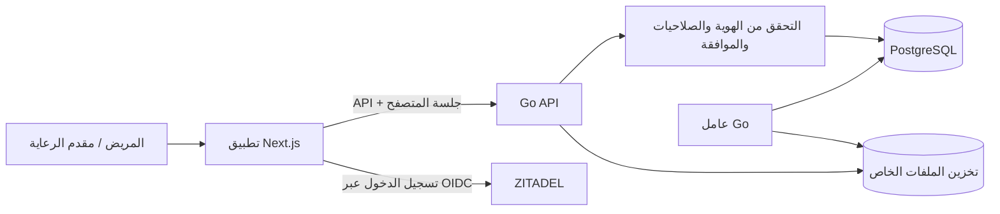

<p align="center">
  
</p>

<h1 align="center">رعايتك الصحية، أقرب إليك</h1>

<p align="center">
  منصة صحية تتمحور حول المريض، تجمع سجله الصحي ومتابعته ومشاركة بياناته بإذنه في مكان واحد.
</p>

<p align="center">
  <a href="docs/planning/IMPLEMENTATION-STATUS.md"></a>
  <a href="frontend/apps/patient-web"></a>
  <a href="backend"></a>
  <a href="frontend/apps/patient-web"></a>
  <a href="backend/README.md"></a>
</p>

<p align="center">
  <a href="prd.md">رؤية المشروع</a> ·
  <a href="docs/planning/ROADMAP.md">خارطة الطريق</a> ·
  <a href="docs/planning/IMPLEMENTATION-STATUS.md">حالة التنفيذ</a> ·
  <a href="contracts/openapi/api.json">عقد API</a>
</p>

---

## 🌿 عن نبض أمان

**نبض أمان** مشروع لمنصة صحية رقمية تساعد المريض على تنظيم معلوماته الصحية ومتابعتها، ومشاركة ما يختاره مع مقدمي الرعاية. دعم الموافقة والخصوصية جزء من تصميم المنتج: تسجيل الدخول يتولاه **ZITADEL**، بينما تبقى صلاحيات البيانات الصحية ومشاركة الرعاية محفوظة ومفحوصة في **PostgreSQL**.

> 📍 **النسخة الحالية قيد التطوير.** يوضح هذا الملف ما يوفره الكود حاليًا، ويفصل ذلك عن أفكار وخطط المراحل المستقبلية.

## ✨ ما يمكنك تجربته الآن

| المجال | ما هو متاح |
|---|---|
| 👤 ملف المريض | ملف شخصي وسجل صحي يدخله المريض، مع سجل للتعديلات |
| 📎 المستندات | رفع ملفات PDF وJPEG وPNG، حجر وفحص قبل العرض، وتنزيل محمي |
| 🕰️ الخط الزمني | عرض السجل والمستندات والقياسات مع البحث والتصفية والتصفح بالصفحات |
| 🤝 مشاركة الرعاية | دعوة عبر بريد موثق، واختيار نطاقات المشاركة والفئات والاستثناءات ومدة الوصول، مع إمكانية سحبها |
| 💓 القياسات | تسجيل النبض والضغط والأكسجين والسكر والحرارة والوزن، وتصحيح القراءات ورؤية اتجاهاتها |
| 🔐 الحساب والخصوصية | سجل النشاط والوصول، وإدارة جلسات المتصفح، وتصدير محدود لبيانات الحساب بصيغة JSON |
| 🌐 تجربة الويب | واجهة عربية وإنجليزية، تدعم RTL وLTR، وصفحات تعريفية عامة |

**المشاركة تبدأ بموافقة المريض:** قبول دعوة مقدم الرعاية لا يفتح السجل تلقائيًا، ولا تمنح هوية ZITADEL وحدها صلاحية الاطلاع على المعلومات الطبية.

## 🧭 ما زال ضمن خارطة الطريق

تطبيق Flutter مؤجل لمرحلة لاحقة. التنبيهات السريرية وPush، والأرشيف الكامل وسياسات الحذف والاحتفاظ، والتخزين المشترك لم تكتمل بعد. بوابات الأطباء والعيادات، والبحث والحجز والمدفوعات، والتكاملات الصحية والكاميرا وميزات الذكاء الاصطناعي هي مراحل مستقبلية وليست وظائف متاحة في الإصدار الحالي.

تسجيل الدخول بحساب Keycloak قديم لا ينقل ملكية الحساب تلقائيًا إلى ZITADEL. ربط الحساب ببياناته السابقة يتطلب مطابقة موثقة لمعرّف الهوية `(issuer, subject)`؛ **البريد الإلكتروني وحده لا يدمج الحسابات**.

## 🏗️ كيف بُني المشروع



<p align="center">
  
</p>

## 🧰 التقنيات

<p>
  
  
  
  
  
  
</p>

- **Backend:** Go وGin وGORM، مع API وعامل مهام منفصل.
- **Web:** Next.js وReact وTypeScript وpnpm.
- **البيانات:** PostgreSQL وترحيلات SQL صريحة؛ وملفات صحية محفوظة في مساحة خاصة.
- **تسجيل الدخول:** ZITADEL عبر OIDC وAuthorization Code مع PKCE.
- **عقد الواجهة:** OpenAPI، مع عميل TypeScript مولد في `frontend/packages/api-client`.

## 📂 نظرة على الملفات

```text
backend/                 Go API والعامل والهوية والتفويض وترحيلات SQL
contracts/openapi/       عقد OpenAPI
contracts/permissions/   كتالوج الصلاحيات
frontend/apps/           تطبيق المريض على الويب
frontend/packages/       عميل API المشترك
docs/planning/           المتطلبات وخطة المراحل وحالة التنفيذ
scripts/                 إعداد الخدمات المحلية وتشغيلها وإيقافها
infra/native/            تعريف الأدوات المحلية
prd.md                   الرؤية ومتطلبات المنتج
```

## 🚀 تشغيل محلي سريع — Windows

تحتاج إلى PowerShell وGo 1.26 وNode.js وpnpm 11 وPostgreSQL، إضافة إلى ملف ZITADEL التنفيذي. سكريبت الإعداد يستخدم ZITADEL الموجود لديك، ويستطيع تثبيت Mailpit عند الحاجة.

من جذر المشروع:

```powershell
powershell.exe -NoProfile -ExecutionPolicy Bypass -File scripts/setup-native.ps1 -ZitadelPath 'C:\tools\zitadel\zitadel.exe'
powershell.exe -NoProfile -ExecutionPolicy Bypass -File scripts/start-native.ps1
```

عدّل مسار `zitadel.exe` حسب مكان الملف على جهازك. إذا كانت الخدمات تعمل بالفعل، أوقفها أولًا عبر `scripts/stop-native.ps1`. عند وجود Mailpit مسبقًا أضف `-SkipTools` لأمر الإعداد. ثم شغّل الواجهة في نافذة أخرى:

```powershell
Set-Location frontend
pnpm install
pnpm dev
```

| الخدمة | العنوان المحلي |
|---|---|
| تطبيق المريض | http://localhost:3000 |
| لوحة ZITADEL | http://localhost:8080/ui/console |
| بريد التحقق المحلي Mailpit | http://localhost:8025 |
| Go API | http://localhost:8081 |
| جاهزية API | http://localhost:8081/health/ready |
| PostgreSQL | `127.0.0.1:55439` |

الأوامر التفصيلية وإعدادات الحساب المحلي والهوية موضحة في [دليل Backend](backend/README.md). قيم الإعداد وكلمات المرور تُحفظ محليًا في `.tmp/native/` و`backend/.env`؛ لا ترفعها إلى GitHub. لإيقاف الخدمات شغّل `scripts/stop-native.ps1`.

## ✅ الفحوصات

```powershell
# Backend
Set-Location backend
go test ./...
go vet ./...

# Web — من مجلد frontend
Set-Location ../frontend
pnpm typecheck
pnpm build
pnpm test:e2e
```

اختبارات قواعد البيانات تحتاج `TEST_DATABASE_URL` لقاعدة اختبار تسمح بإنشاء مخططات مؤقتة. اختبارات الواجهة تستخدم بيانات API تجريبية؛ اختبار الدخول الحقيقي يحتاج تشغيل الخدمات وMicrosoft Edge:

```powershell
node backend/tests/native_auth_smoke.cjs
```

ينشئ اختبار الدخول مريضًا تجريبيًا ورسالة تحقق في Mailpit، ويتركهما للمراجعة.

## 📚 اقرأ أكثر

| الوثيقة | المحتوى |
|---|---|
| [متطلبات المنتج](prd.md) | الرؤية الكاملة للمشروع |
| [خارطة الطريق](docs/planning/ROADMAP.md) | المراحل والاعتماديات ومعايير التسليم |
| [حالة التنفيذ](docs/planning/IMPLEMENTATION-STATUS.md) | ما اكتمل وما هو قيد العمل |
| [خطة المنتج](docs/planning/README.md) | القرارات والاتجاه المعتمد |
| [تصميم الواجهة](frontend/design.md) | نظام التصميم والهوية |
| [API](contracts/openapi/api.json) | العقد الحالي للواجهة |
| [Backend وتشغيل ZITADEL](backend/README.md) | الإعداد والتشغيل والهوية |

---

<p align="center">
  <sub>صُنع بعناية 💚 لمستقبل تكون فيه الرعاية الصحية أوضح وأكثر ترابطًا.</sub>
</p>
